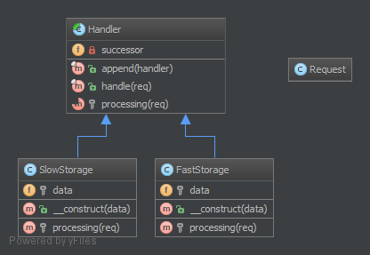

`Chain Of Responsibilities`__
=============================

Purpose:
--------

To build a chain of objects to handle a call in sequential order. If one
object cannot handle a call, it delegates the call to the next in the
chain and so forth.

Examples:
---------

-  logging framework, where each chain element decides autonomously what
   to do with a log message
-  a Spam filter
-  Caching: first object is an instance of e.g. a Memcached Interface,
   if that "misses" it delegates the call to the database interface
-  Yii Framework: CFilterChain is a chain of controller action filters.
   the executing point is passed from one filter to the next along the
   chain, and only if all filters say "yes", the action can be invoked
   at last.

UML Diagram
-----------

Code
----

You can also find these code on `GitHub`_

Request.php

.. literalinclude:: Request.php
   :language: php
   :linenos:

Handler.php

.. literalinclude:: Handler.php
   :language: php
   :linenos:

Responsible/SlowStorage.php

.. literalinclude:: Responsible/SlowStorage.php
   :language: php
   :linenos:

Responsible/FastStorage.php

.. literalinclude:: Responsible/FastStorage.php
   :language: php
   :linenos:

Test
----

Tests/ChainTest.php

.. literalinclude:: Tests/ChainTest.php
   :language: php
   :linenos:

.. _`GitHub`: https://github.com/domnikl/DesignPatternsPHP/tree/master/Behavioral/ChainOfResponsibilities
.. __: http://en.wikipedia.org/wiki/Chain_of_responsibility_pattern