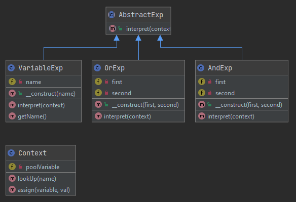

`Interpreter`__
===============

Purpose
-------

For a given language, it defines the representation of its grammar as
"No Terminal Expression" and "Terminal Expression",
as well as an interpreter for the sentences of that language.

Examples
--------

-  An example of a binary logic interpreter, each definition is defined by its own class

UML Diagram
-----------

Code
----

You can also find this code on `GitHub`_

AbstractExp.php

.. literalinclude:: AbstractExp.php
   :language: php
   :linenos:

Context.php

.. literalinclude:: Context.php
   :language: php
   :linenos:

VariableExp.php

.. literalinclude:: VariableExp.php
   :language: php
   :linenos:

AndExp.php

.. literalinclude:: AndExp.php
   :language: php
   :linenos:

OrExp.php

.. literalinclude:: OrExp.php
   :language: php
   :linenos:

Test
----

Tests/InterpreterTest.php

.. literalinclude:: Tests/InterpreterTest.php
   :language: php
   :linenos:

.. _`GitHub`: https://github.com/DesignPatternsPHP/DesignPatternsPHP/tree/main/Behavioral/Interpreter
.. __: https://en.wikipedia.org/wiki/Interpreter_pattern
