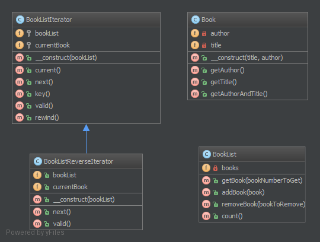

`Iterator`__
============

Purpose
-------

To make an object iterable and to make it appear like a collection of objects.

Examples
--------

-  to process a file line by line by just running over all lines (which
   have an object representation) for a file (which of course is an
   object, too)

Note
----

Standard PHP Library (SPL) defines an interface Iterator which is best
suited for this! Often you would want to implement the Countable
interface too, to allow ``count($object)`` on your iterable object

UML Diagram
-----------

Code
----

You can also find this code on `GitHub`_

Book.php

.. literalinclude:: Book.php
   :language: php
   :linenos:

BookList.php

.. literalinclude:: BookList.php
   :language: php
   :linenos:

Test
----

Tests/IteratorTest.php

.. literalinclude:: Tests/IteratorTest.php
   :language: php
   :linenos:

.. _`GitHub`: https://github.com/domnikl/DesignPatternsPHP/tree/master/Behavioral/Iterator
.. __: http://en.wikipedia.org/wiki/Iterator_pattern
