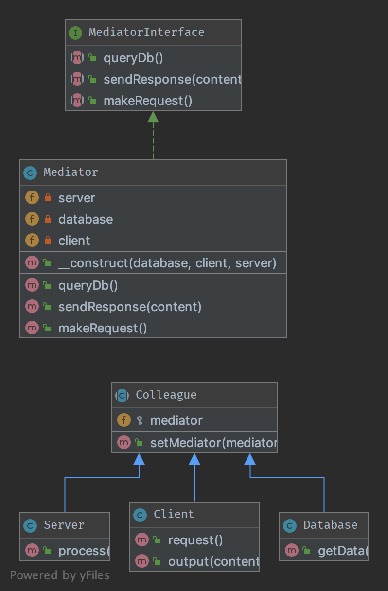

`Mediator`__
============

Purpose
-------

This pattern provides an easy way to decouple many components working
together. It is a good alternative to Observer IF you have a "central
intelligence", like a controller (but not in the sense of the MVC).

All components (called Colleague) are only coupled to the
MediatorInterface and it is a good thing because in OOP, one good friend
is better than many. This is the key-feature of this pattern.

UML Diagram
-----------

Code
----

You can also find this code on `GitHub`_

MediatorInterface.php

.. literalinclude:: MediatorInterface.php
   :language: php
   :linenos:

Mediator.php

.. literalinclude:: Mediator.php
   :language: php
   :linenos:

Colleague.php

.. literalinclude:: Colleague.php
   :language: php
   :linenos:

Subsystem/Client.php

.. literalinclude:: Subsystem/Client.php
   :language: php
   :linenos:

Subsystem/Database.php

.. literalinclude:: Subsystem/Database.php
   :language: php
   :linenos:

Subsystem/Server.php

.. literalinclude:: Subsystem/Server.php
   :language: php
   :linenos:

Test
----

Tests/MediatorTest.php

.. literalinclude:: Tests/MediatorTest.php
   :language: php
   :linenos:

.. _`GitHub`: https://github.com/domnikl/DesignPatternsPHP/tree/master/Behavioral/Mediator
.. __: http://en.wikipedia.org/wiki/Mediator_pattern
