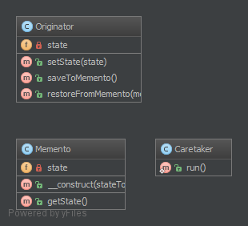

`Memento`__
===========

Purpose
-------

It provides the ability to restore an object to it's previous state (undo
via rollback) or to gain access to state of the object, without revealing
it's implementation (i.e., the object is not required to have a functional
for return the current state).

The memento pattern is implemented with three objects: the Originator, a
Caretaker and a Memento.

Memento – an object that *contains a concrete unique snapshot of state* of
any object or resource: string, number, array, an instance of class and so on.
The uniqueness in this case does not imply the prohibition existence of similar
states in different snapshots. That means the state can be extracted as
the independent clone. Any object stored in the Memento should be
*a full copy of the original object rather than a reference* to the original
object. The Memento object is a "opaque object" (the object that no one can
or should change).

Originator – it is an object that contains the *actual state of an external
object is strictly specified type*. Originator is able to create a unique
copy of this state and return it wrapped in a Memento. The Originator does
not know the history of changes. You can set a concrete state to Originator
from the outside, which will be considered as actual. The Originator must
make sure that given state corresponds the allowed type of object. Originator
may (but not should) have any methods, but they *they can't make changes to
the saved object state*.

Caretaker *controls the states history*. He may make changes to an object;
take a decision to save the state of an external object in the Originator;
ask from the Originator snapshot of the current state; or set the Originator
state to equivalence with some snapshot from history.

Examples
--------

-  The seed of a pseudorandom number generator
-  The state in a finite state machine
-  Control for intermediate states of `ORM Model <http://en.wikipedia.org/wiki/Object-relational_mapping>`_ before saving

UML Diagram
-----------

Code
----

You can also find these code on `GitHub`_

Memento.php

.. literalinclude:: Memento.php
   :language: php
   :linenos:

Originator.php

.. literalinclude:: Originator.php
   :language: php
   :linenos:

Caretaker.php

.. literalinclude:: Caretaker.php
   :language: php
   :linenos:

Test
----

Tests/MementoTest.php

.. literalinclude:: Tests/MementoTest.php
   :language: php
   :linenos:

.. _`GitHub`: https://github.com/domnikl/DesignPatternsPHP/tree/master/Behavioral/Memento
.. __: http://en.wikipedia.org/wiki/Memento_pattern