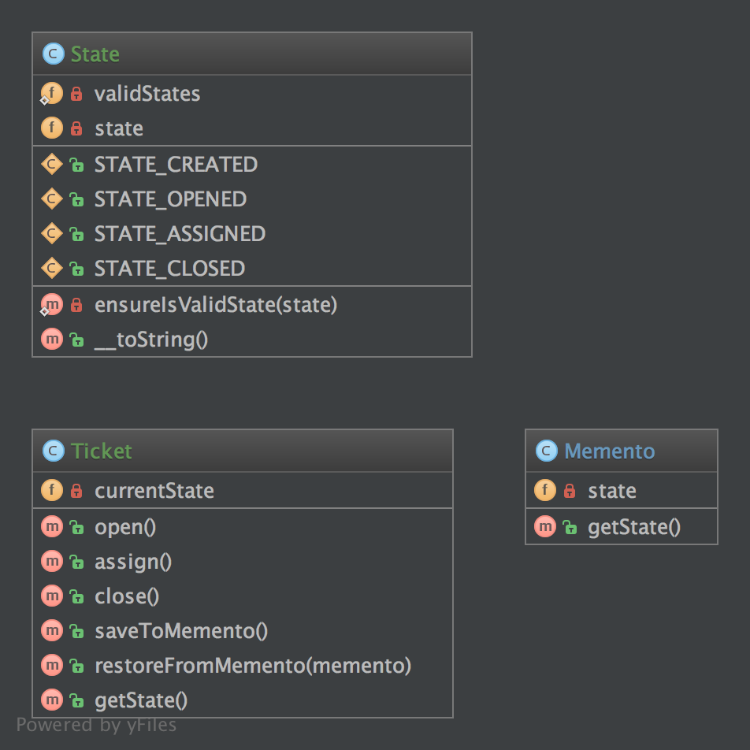

`Memento`_
==========

Purpose
-------

Provide the ability to restore an object to its previous state (undo via
rollback).

The memento pattern is implemented with three objects: the originator, a
caretaker and a memento. The originator is some object that has an
internal state. The caretaker is going to do something to the
originator, but wants to be able to undo the change. The caretaker first
asks the originator for a memento object. Then it does whatever
operation (or sequence of operations) it was going to do. To roll back
to the state before the operations, it returns the memento object to the
originator. The memento object itself is an opaque object (one which the
caretaker cannot, or should not, change). When using this pattern, care
should be taken if the originator may change other objects or resources
- the memento pattern operates on a single object.

Examples
--------

-  The seed of a pseudorandom number generator
-  The state in a finite state machine

UML Diagram
-----------

Code
----

You can also find these code on `GitHub`_

Memento.php

.. literalinclude:: Memento.php
   :language: php
   :linenos:

Originator.php

.. literalinclude:: Originator.php
   :language: php
   :linenos:

Caretaker.php

.. literalinclude:: Caretaker.php
   :language: php
   :linenos:

Test
----

Tests/MementoTest.php

.. literalinclude:: Tests/MementoTest.php
   :language: php
   :linenos:

.. _`GitHub`: https://github.com/domnikl/DesignPatternsPHP/tree/master/Behavioral/Memento
.. _`Memento`: http://en.wikipedia.org/wiki/Memento_pattern