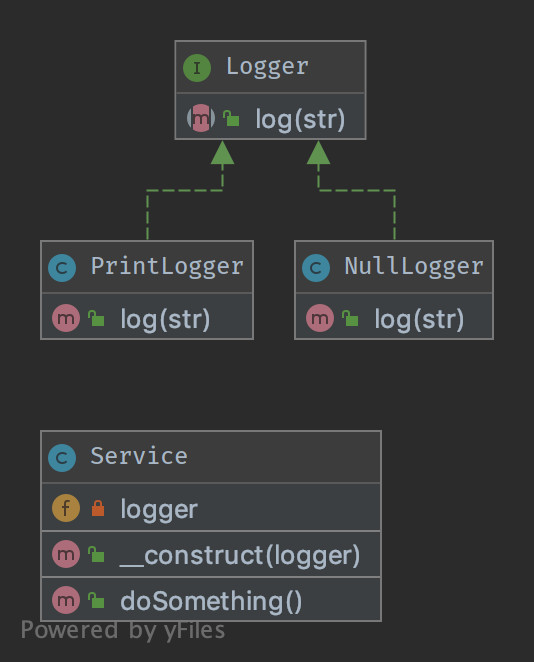

# Null Object

## Purpose

NullObject is not a GoF design pattern but a schema which appears frequently enough to be considered a pattern. It has the following benefits:

* Client code is simplified
* Reduces the chance of null pointer exceptions
* Fewer conditionals require less test cases

Methods that return an object or null should instead return an object or `NullObject`. `NullObject`s simplify boilerplate code such as `if (!is_null($obj)) { $obj->callSomething(); }` to just `$obj->callSomething();` by eliminating the conditional check in client code.

## Examples

* Symfony2: null logger of profiler
* Symfony2: null output in Symfony/Console
* null handler in a Chain of Responsibilities pattern
* null command in a Command pattern

## UML Diagram

