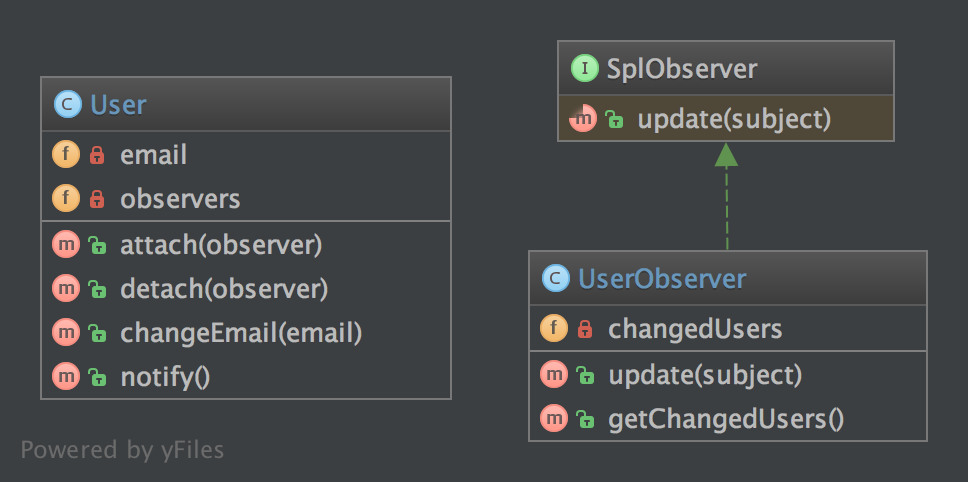

`Observer`__
============

Purpose
-------

To implement a publish/subscribe behaviour to an object, whenever a
"Subject" object changes it's state, the attached "Observers" will be
notified. It is used to shorten the amount of coupled objects and uses
loose coupling instead.

Examples
--------

-  a message queue system is observed to show the progress of a job in a
   GUI

Note
----

PHP already defines two interfaces that can help to implement this
pattern: SplObserver and SplSubject.

UML Diagram
-----------

Code
----

You can also find these code on `GitHub`_

User.php

.. literalinclude:: User.php
   :language: php
   :linenos:

UserObserver.php

.. literalinclude:: UserObserver.php
   :language: php
   :linenos:

Test
----

Tests/ObserverTest.php

.. literalinclude:: Tests/ObserverTest.php
   :language: php
   :linenos:

.. _`GitHub`: https://github.com/domnikl/DesignPatternsPHP/tree/master/Behavioral/Observer
.. __: http://en.wikipedia.org/wiki/Observer_pattern