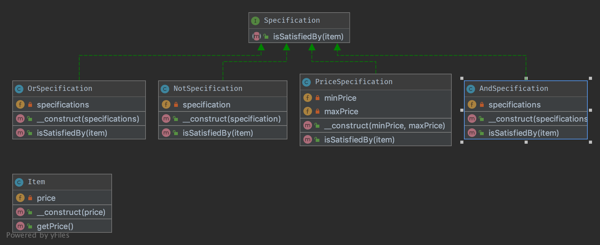

`Specification`__
=================

Purpose
-------

Builds a clear specification of business rules, where objects can be
checked against. The composite specification class has one method called
``isSatisfiedBy`` that returns either true or false depending on whether
the given object satisfies the specification.

Examples
--------

-  `RulerZ <https://github.com/K-Phoen/rulerz>`__ 

UML Diagram
-----------

Code
----

You can also find these code on `GitHub`_

Item.php

.. literalinclude:: Item.php
   :language: php
   :linenos:

SpecificationInterface.php

.. literalinclude:: SpecificationInterface.php
   :language: php
   :linenos:

AbstractSpecification.php

.. literalinclude:: AbstractSpecification.php
   :language: php
   :linenos:

Either.php

.. literalinclude:: Either.php
   :language: php
   :linenos:

PriceSpecification.php

.. literalinclude:: PriceSpecification.php
   :language: php
   :linenos:

Plus.php

.. literalinclude:: Plus.php
   :language: php
   :linenos:

Not.php

.. literalinclude:: Not.php
   :language: php
   :linenos:

Test
----

Tests/SpecificationTest.php

.. literalinclude:: Tests/SpecificationTest.php
   :language: php
   :linenos:

.. _`GitHub`: https://github.com/domnikl/DesignPatternsPHP/tree/master/Behavioral/Specification
.. __: http://en.wikipedia.org/wiki/Specification_pattern
