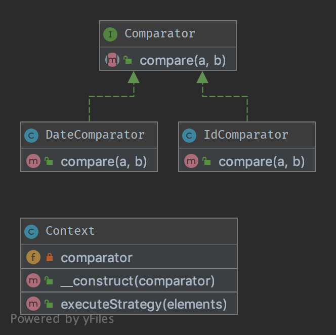

`Strategy`__
============

Terminology:
------------

-  Context
-  Strategy
-  Concrete Strategy

Purpose
-------

To separate strategies and to enable fast switching between them. Also
this pattern is a good alternative to inheritance (instead of having an
abstract class that is extended).

Examples
--------

-  sorting a list of objects, one strategy by date, the other by id
-  simplify unit testing: e.g. switching between file and in-memory
   storage

UML Diagram
-----------

Code
----

You can also find these code on `GitHub`_

ObjectCollection.php

.. literalinclude:: ObjectCollection.php
   :language: php
   :linenos:

ComparatorInterface.php

.. literalinclude:: ComparatorInterface.php
   :language: php
   :linenos:

DateComparator.php

.. literalinclude:: DateComparator.php
   :language: php
   :linenos:

IdComparator.php

.. literalinclude:: IdComparator.php
   :language: php
   :linenos:

Test
----

Tests/StrategyTest.php

.. literalinclude:: Tests/StrategyTest.php
   :language: php
   :linenos:

.. _`GitHub`: https://github.com/domnikl/DesignPatternsPHP/tree/master/Behavioral/Strategy
.. __: http://en.wikipedia.org/wiki/Strategy_pattern