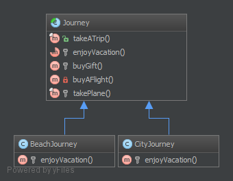

`Template Method`__
===================

Purpose
-------

Template Method is a behavioral design pattern.

Perhaps you have encountered it many times already. The idea is to let
subclasses of this abstract template "finish" the behavior of an
algorithm.

A.k.a the "Hollywood principle": "Don't call us, we call you." This
class is not called by subclasses but the inverse. How? With abstraction
of course.

In other words, this is a skeleton of algorithm, well-suited for
framework libraries. The user has just to implement one method and the
superclass do the job.

It is an easy way to decouple concrete classes and reduce copy-paste,
that's why you'll find it everywhere.

UML Diagram
-----------

Code
----

You can also find these code on `GitHub`_

Journey.php

.. literalinclude:: Journey.php
   :language: php
   :linenos:

BeachJourney.php

.. literalinclude:: BeachJourney.php
   :language: php
   :linenos:

CityJourney.php

.. literalinclude:: CityJourney.php
   :language: php
   :linenos:

Test
----

Tests/JourneyTest.php

.. literalinclude:: Tests/JourneyTest.php
   :language: php
   :linenos:

.. _`GitHub`: https://github.com/domnikl/DesignPatternsPHP/tree/master/Behavioral/TemplateMethod
.. __: http://en.wikipedia.org/wiki/Template_method_pattern