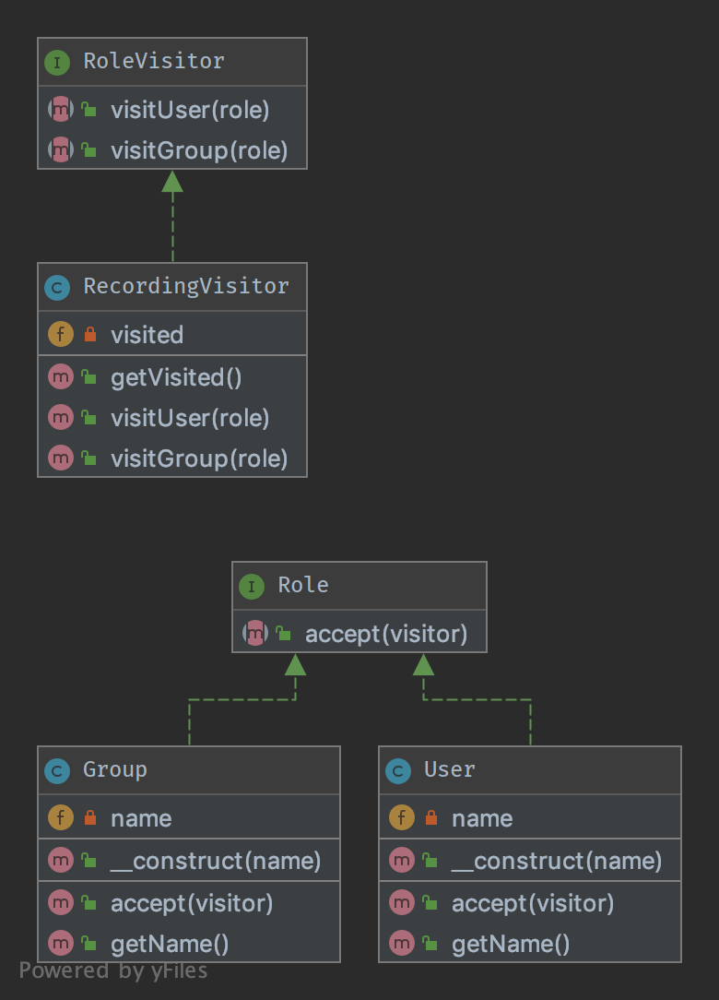

`Visitor`__
===========

Purpose
-------

The Visitor Pattern lets you outsource operations on objects to other
objects. The main reason to do this is to keep a separation of concerns.
But classes have to define a contract to allow visitors (the
``Role::accept`` method in the example).

The contract is an abstract class but you can have also a clean
interface. In that case, each Visitor has to choose itself which method
to invoke on the visitor.

UML Diagram
-----------

Code
----

You can also find this code on `GitHub`_

RoleVisitorInterface.php

.. literalinclude:: RoleVisitorInterface.php
   :language: php
   :linenos:

RoleVisitor.php

.. literalinclude:: RoleVisitor.php
   :language: php
   :linenos:

Role.php

.. literalinclude:: Role.php
   :language: php
   :linenos:

User.php

.. literalinclude:: User.php
   :language: php
   :linenos:

Group.php

.. literalinclude:: Group.php
   :language: php
   :linenos:

Test
----

Tests/VisitorTest.php

.. literalinclude:: Tests/VisitorTest.php
   :language: php
   :linenos:

.. _`GitHub`: https://github.com/domnikl/DesignPatternsPHP/tree/master/Behavioral/Visitor
.. __: http://en.wikipedia.org/wiki/Visitor_pattern