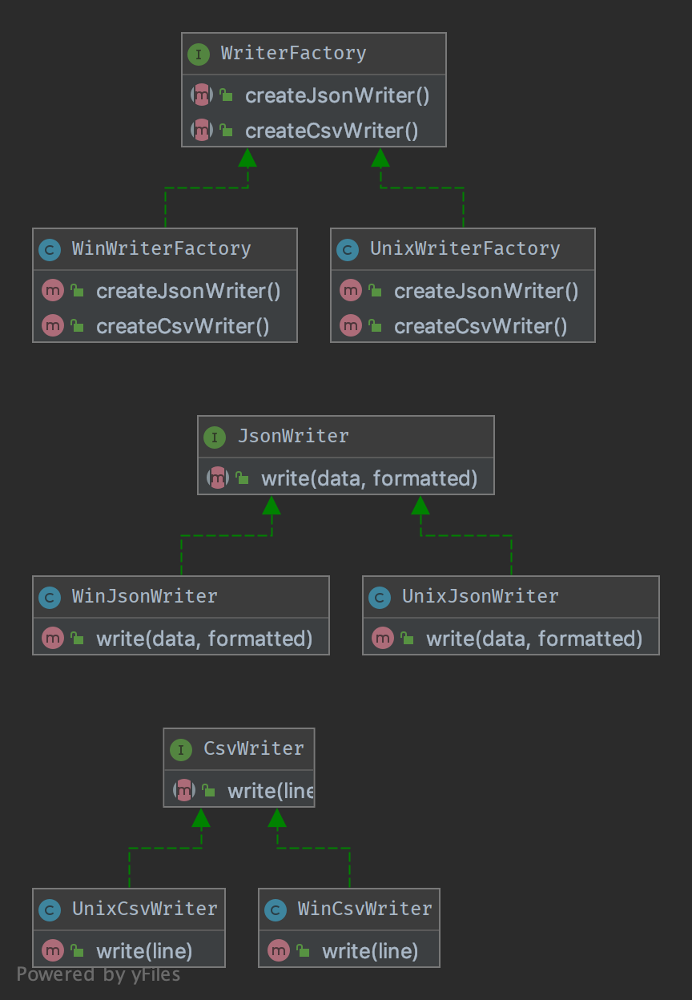

`Abstract Factory`__
====================

Purpose
-------

To create series of related or dependent objects without specifying
their concrete classes. Usually the created classes all implement the
same interface. The client of the abstract factory does not care about
how these objects are created, he just knows how they go together.

UML Diagram
-----------

Code
----

You can also find these code on `GitHub`_

AbstractFactory.php

.. literalinclude:: AbstractFactory.php
   :language: php
   :linenos:

JsonFactory.php

.. literalinclude:: JsonFactory.php
   :language: php
   :linenos:

HtmlFactory.php

.. literalinclude:: HtmlFactory.php
   :language: php
   :linenos:

MediaInterface.php

.. literalinclude:: MediaInterface.php
   :language: php
   :linenos:

Picture.php

.. literalinclude:: Picture.php
   :language: php
   :linenos:

Text.php

.. literalinclude:: Text.php
   :language: php
   :linenos:

Json/Picture.php

.. literalinclude:: Json/Picture.php
   :language: php
   :linenos:

Json/Text.php

.. literalinclude:: Json/Text.php
   :language: php
   :linenos:

Html/Picture.php

.. literalinclude:: Html/Picture.php
   :language: php
   :linenos:

Html/Text.php

.. literalinclude:: Html/Text.php
   :language: php
   :linenos:

Test
----

Tests/AbstractFactoryTest.php

.. literalinclude:: Tests/AbstractFactoryTest.php
   :language: php
   :linenos:

.. _`GitHub`: https://github.com/domnikl/DesignPatternsPHP/tree/master/Creational/AbstractFactory
.. __: http://en.wikipedia.org/wiki/Abstract_factory_pattern
