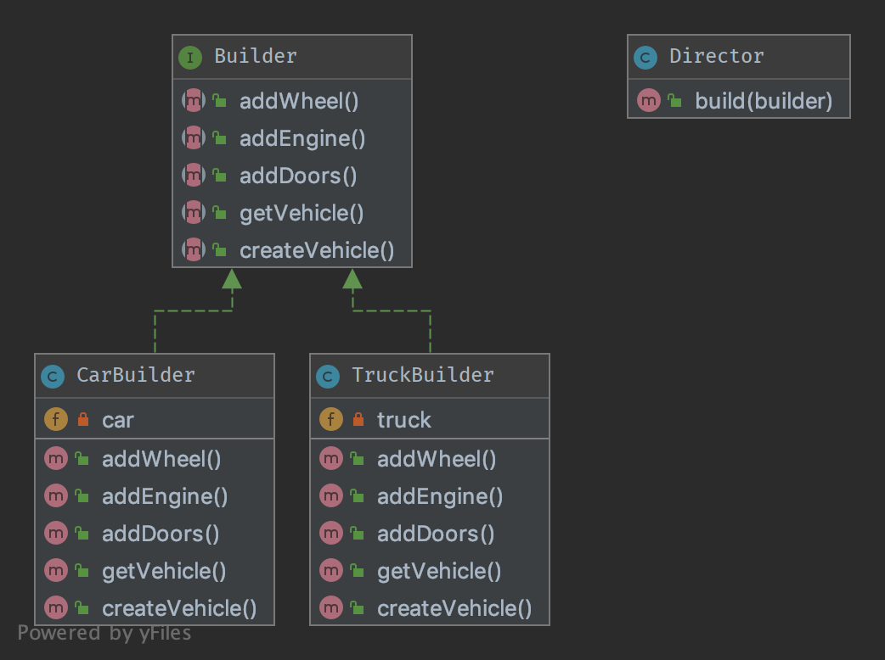

`Builder`__
===========

Purpose
-------

Builder is an interface that build parts of a complex object.

Sometimes, if the builder has a better knowledge of what it builds, this
interface could be an abstract class with default methods (aka adapter).

If you have a complex inheritance tree for objects, it is logical to
have a complex inheritance tree for builders too.

Note: Builders have often a fluent interface, see the mock builder of
PHPUnit for example.

Examples
--------

-  PHPUnit: Mock Builder

UML Diagram
-----------

Code
----

You can also find this code on `GitHub`_

Director.php

.. literalinclude:: Director.php
   :language: php
   :linenos:

BuilderInterface.php

.. literalinclude:: BuilderInterface.php
   :language: php
   :linenos:

TruckBuilder.php

.. literalinclude:: TruckBuilder.php
   :language: php
   :linenos:

CarBuilder.php

.. literalinclude:: CarBuilder.php
   :language: php
   :linenos:

Parts/Vehicle.php

.. literalinclude:: Parts/Vehicle.php
   :language: php
   :linenos:

Parts/Truck.php

.. literalinclude:: Parts/Truck.php
   :language: php
   :linenos:

Parts/Car.php

.. literalinclude:: Parts/Car.php
   :language: php
   :linenos:

Parts/Engine.php

.. literalinclude:: Parts/Engine.php
   :language: php
   :linenos:

Parts/Wheel.php

.. literalinclude:: Parts/Wheel.php
   :language: php
   :linenos:

Parts/Door.php

.. literalinclude:: Parts/Door.php
   :language: php
   :linenos:

Test
----

Tests/DirectorTest.php

.. literalinclude:: Tests/DirectorTest.php
   :language: php
   :linenos:

.. _`GitHub`: https://github.com/domnikl/DesignPatternsPHP/tree/master/Creational/Builder
.. __: http://en.wikipedia.org/wiki/Builder_pattern
