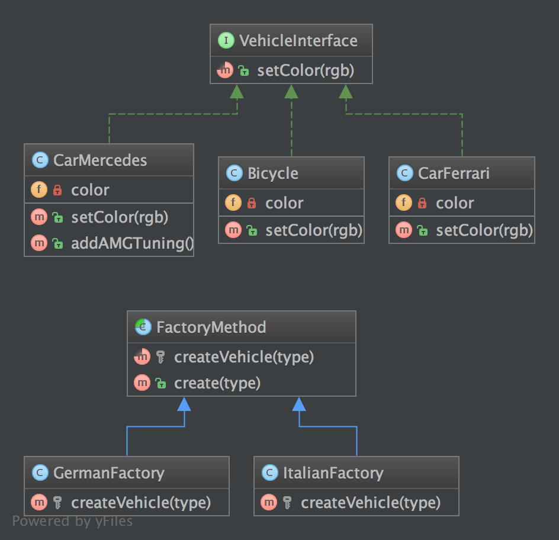

`Factory Method`__
==================

Purpose
-------

The good point over the SimpleFactory is you can subclass it to
implement different ways to create objects.

For simple cases, this abstract class could be just an interface.

This pattern is a "real" Design Pattern because it achieves the
Dependency Inversion principle a.k.a the "D" in SOLID principles.

It means the FactoryMethod class depends on abstractions, not concrete
classes. This is the real trick compared to SimpleFactory or
StaticFactory.

UML Diagram
-----------

Code
----

You can also find this code on `GitHub`_

Logger.php

.. literalinclude:: Logger.php
   :language: php
   :linenos:

StdoutLogger.php

.. literalinclude:: StdoutLogger.php
   :language: php
   :linenos:

FileLogger.php

.. literalinclude:: FileLogger.php
   :language: php
   :linenos:

LoggerFactory.php

.. literalinclude:: LoggerFactory.php
   :language: php
   :linenos:

StdoutLoggerFactory.php

.. literalinclude:: StdoutLoggerFactory.php
   :language: php
   :linenos:

FileLoggerFactory.php

.. literalinclude:: FileLoggerFactory.php
   :language: php
   :linenos:

Test
----

Tests/FactoryMethodTest.php

.. literalinclude:: Tests/FactoryMethodTest.php
   :language: php
   :linenos:

.. _`GitHub`: https://github.com/domnikl/DesignPatternsPHP/tree/master/Creational/FactoryMethod
.. __: http://en.wikipedia.org/wiki/Factory_method_pattern
