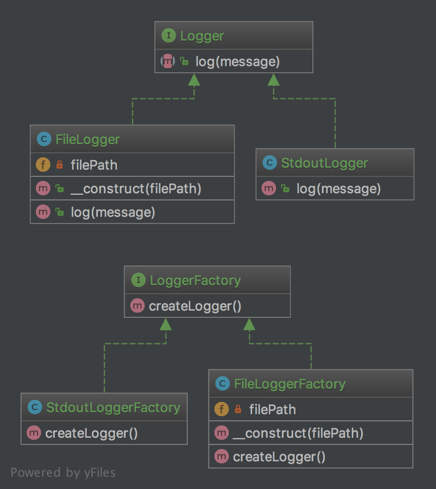

`Factory Method`__
==================

Purpose
-------

The good point over the SimpleFactory is you can subclass it to
implement different ways to create objects

For simple case, this abstract class could be just an interface

This pattern is a "real" Design Pattern because it achieves the
"Dependency Inversion Principle" a.k.a the "D" in S.O.L.I.D principles.

It means the FactoryMethod class depends on abstractions, not concrete
classes. This is the real trick compared to SimpleFactory or
StaticFactory.

UML Diagram
-----------

Code
----

You can also find these code on `GitHub`_

FactoryMethod.php

.. literalinclude:: FactoryMethod.php
   :language: php
   :linenos:

ItalianFactory.php

.. literalinclude:: ItalianFactory.php
   :language: php
   :linenos:

GermanFactory.php

.. literalinclude:: GermanFactory.php
   :language: php
   :linenos:

VehicleInterface.php

.. literalinclude:: VehicleInterface.php
   :language: php
   :linenos:

Porsche.php

.. literalinclude:: Porsche.php
   :language: php
   :linenos:

Bicycle.php

.. literalinclude:: Bicycle.php
   :language: php
   :linenos:

Ferrari.php

.. literalinclude:: Ferrari.php
   :language: php
   :linenos:

Test
----

Tests/FactoryMethodTest.php

.. literalinclude:: Tests/FactoryMethodTest.php
   :language: php
   :linenos:

.. _`GitHub`: https://github.com/domnikl/DesignPatternsPHP/tree/master/Creational/FactoryMethod
.. __: http://en.wikipedia.org/wiki/Factory_method_pattern
