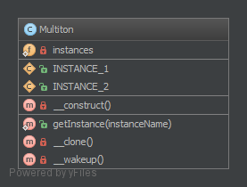

Multiton
========

**THIS IS CONSIDERED TO BE AN ANTI-PATTERN! FOR BETTER TESTABILITY AND
MAINTAINABILITY USE DEPENDENCY INJECTION!**

Purpose
-------

To have only a list of named instances that are used, like a singleton
but with n instances.

Examples
--------

-  2 DB Connectors, e.g. one for MySQL, the other for SQLite
-  multiple Loggers (one for debug messages, one for errors)

UML Diagram
-----------

Code
----

You can also find this code on `GitHub`_

Multiton.php

.. literalinclude:: Multiton.php
   :language: php
   :linenos:

Test
----

.. _`GitHub`: https://github.com/domnikl/DesignPatternsPHP/tree/master/Creational/Multiton
