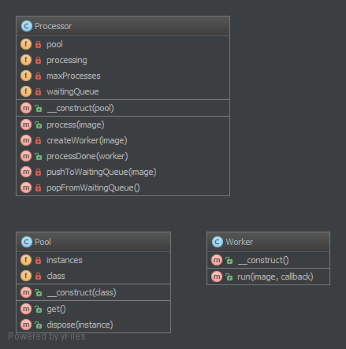

`Pool`__
========

Purpose
-------

The **object pool pattern** is a software creational design pattern that
uses a set of initialized objects kept ready to use – a "pool" – rather
than allocating and destroying them on demand. A client of the pool will
request an object from the pool and perform operations on the returned
object. When the client has finished, it returns the object, which is a
specific type of factory object, to the pool rather than destroying it.

Object pooling can offer a significant performance boost in situations
where the cost of initializing a class instance is high, the rate of
instantiation of a class is high, and the number of instances in use at
any one time is low. The pooled object is obtained in predictable time
when creation of the new objects (especially over network) may take
variable time.

However these benefits are mostly true for objects that are expensive
with respect to time, such as database connections, socket connections,
threads and large graphic objects like fonts or bitmaps. In certain
situations, simple object pooling (that hold no external resources, but
only occupy memory) may not be efficient and could decrease performance.

UML Diagram
-----------

Code
----

You can also find this code on `GitHub`_

WorkerPool.php

.. literalinclude:: WorkerPool.php
   :language: php
   :linenos:

StringReverseWorker.php

.. literalinclude:: StringReverseWorker.php
   :language: php
   :linenos:

Test
----

Tests/PoolTest.php

.. literalinclude:: Tests/PoolTest.php
   :language: php
   :linenos:

.. _`GitHub`: https://github.com/domnikl/DesignPatternsPHP/tree/master/Creational/Pool
.. __: http://en.wikipedia.org/wiki/Object_pool_pattern
