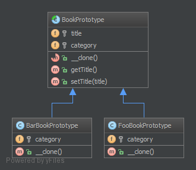

`Prototype`__
=============

Purpose
-------

To avoid the cost of creating objects the standard way (new Foo()) and
instead create a prototype and clone it.

Examples
--------

-  Large amounts of data (e.g. create 1,000,000 rows in a database at
   once via a ORM).

UML Diagram
-----------

Code
----

You can also find these code on `GitHub`_

index.php

.. literalinclude:: index.php
   :language: php
   :linenos:

BookPrototype.php

.. literalinclude:: BookPrototype.php
   :language: php
   :linenos:

BarBookPrototype.php

.. literalinclude:: BarBookPrototype.php
   :language: php
   :linenos:

FooBookPrototype.php

.. literalinclude:: FooBookPrototype.php
   :language: php
   :linenos:

Test
----

.. _`GitHub`: https://github.com/domnikl/DesignPatternsPHP/tree/master/Creational/Prototype
.. __: http://en.wikipedia.org/wiki/Prototype_pattern
