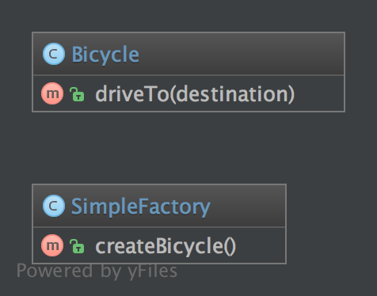

Simple Factory
==============

Purpose
-------

SimpleFactory is a simple factory pattern.

It differs from the static factory because it is not static.
Therefore, you can have multiple factories, differently parameterized, you can subclass it and you can mock it.
It always should be preferred over a static factory!

UML Diagram
-----------

Code
----

You can also find this code on `GitHub`_

SimpleFactory.php

.. literalinclude:: SimpleFactory.php
   :language: php
   :linenos:

Bicycle.php

.. literalinclude:: Bicycle.php
   :language: php
   :linenos:

Usage
-----

.. code-block::  php
   :linenos:

    $factory = new SimpleFactory();
    $bicycle = $factory->createBicycle();
    $bicycle->driveTo('Paris');

Test
----

Tests/SimpleFactoryTest.php

.. literalinclude:: Tests/SimpleFactoryTest.php
   :language: php
   :linenos:

.. _`GitHub`: https://github.com/domnikl/DesignPatternsPHP/tree/master/Creational/SimpleFactory
