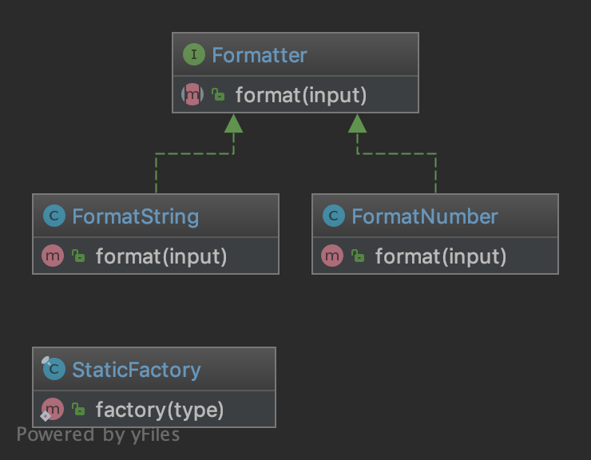

Static Factory
==============

Purpose
-------

Similar to the AbstractFactory, this pattern is used to create series of
related or dependent objects. The difference between this and the
abstract factory pattern is that the static factory pattern uses just
one static method to create all types of objects it can create. It is
usually named ``factory`` or ``build``.

Examples
--------

-  Zend Framework: ``Zend_Cache_Backend`` or ``_Frontend`` use a factory
   method to create cache backends and frontends

UML Diagram
-----------

Code
----

You can also find this code on `GitHub`_

StaticFactory.php

.. literalinclude:: StaticFactory.php
   :language: php
   :linenos:

Formatter.php

.. literalinclude:: Formatter.php
   :language: php
   :linenos:

FormatString.php

.. literalinclude:: FormatString.php
   :language: php
   :linenos:

FormatNumber.php

.. literalinclude:: FormatNumber.php
   :language: php
   :linenos:

Test
----

Tests/StaticFactoryTest.php

.. literalinclude:: Tests/StaticFactoryTest.php
   :language: php
   :linenos:

.. _`GitHub`: https://github.com/domnikl/DesignPatternsPHP/tree/master/Creational/StaticFactory
