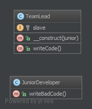

`Delegation`__
==============

Purpose
-------

Demonstrate the Delegator pattern, where an object, instead of performing one of its stated tasks, delegates that task to an associated helper object. In this case TeamLead professes to writeCode and Usage uses this, while TeamLead delegates writeCode to JuniorDeveloper's writeBadCode function. This inverts the responsibility so that Usage is unknowingly executing writeBadCode.

Examples
--------

Please review JuniorDeveloper.php, TeamLead.php, and then Usage.php to see it all tied together.

UML Diagram
-----------

Code
----

You can also find these code on `GitHub`_

Usage.php

.. literalinclude:: Usage.php
   :language: php
   :linenos:

TeamLead.php

.. literalinclude:: TeamLead.php
   :language: php
   :linenos:

JuniorDeveloper.php

.. literalinclude:: JuniorDeveloper.php
   :language: php
   :linenos:

Test
----

Tests/DelegationTest.php

.. literalinclude:: Tests/DelegationTest.php
   :language: php
   :linenos:

.. _`GitHub`: https://github.com/domnikl/DesignPatternsPHP/tree/master/More/Delegation
.. __: http://en.wikipedia.org/wiki/Delegation_pattern
