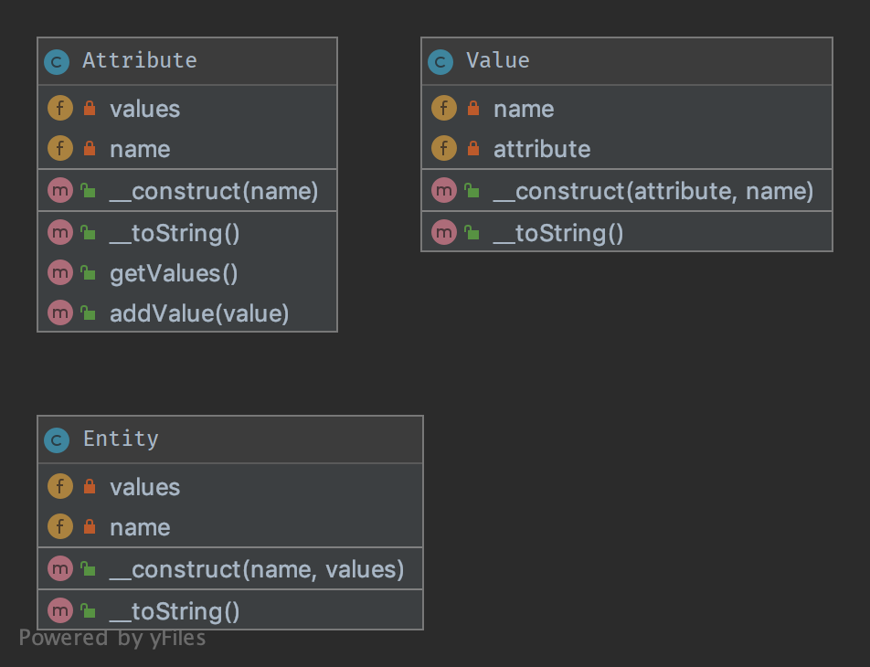

`Entity-Attribute-Value (EAV)`__
================================

The Entity–attribute–value (EAV) pattern in order to implement EAV model with PHP.

Purpose
-------

The Entity–attribute–value (EAV) model is a data model to describe entities
where the number of attributes (properties, parameters) that can be used
to describe them is potentially vast, but the number that will actually apply
to a given entity is relatively modest.

Examples
--------

Check full work example in `example.php`_ file.

.. code-block:: php

    use DesignPatterns\More\EAV\Entity;
    use DesignPatterns\More\EAV\Attribute;
    use DesignPatterns\More\EAV\Value;

    // Create color attribute
    $color = (new Attribute())->setName('Color');
    // Create color values
    $colorSilver    = (new Value($color))->setName('Silver');
    $colorGold      = (new Value($color))->setName('Gold');
    $colorSpaceGrey = (new Value($color))->setName('Space Grey');

    // Create memory attribute
    $memory  = (new Attribute())->setName('Memory');
    // Create memory values
    $memory4Gb  = (new Value($memory))->setName('4GB');
    $memory8Gb  = (new Value($memory))->setName('8GB');
    $memory16Gb = (new Value($memory))->setName('16GB');

    // Create storage attribute
    $storage  = (new Attribute())->setName('Storage');
    // Create storage values
    $storage128Gb   = (new Value($storage))->setName('128GB');
    $storage256Gb   = (new Value($storage))->setName('256GB');
    $storage512Gb   = (new Value($storage))->setName('512GB');
    $storage1Tb     = (new Value($storage))->setName('1TB');

    // Create entities with specific values
    $mac = (new Entity())
        ->setName('MacBook')
        // colors
        ->addValue($colorSilver)
        ->addValue($colorGold)
        ->addValue($colorSpaceGrey)
        // memories
        ->addValue($memory8Gb)
        // storages
        ->addValue($storage256Gb)
        ->addValue($storage512Gb)
    ;

    $macAir = (new Entity())
        ->setName('MacBook Air')
        // colors
        ->addValue($colorSilver)
        // memories
        ->addValue($memory4Gb)
        ->addValue($memory8Gb)
        // storages
        ->addValue($storage128Gb)
        ->addValue($storage256Gb)
        ->addValue($storage512Gb)
    ;

    $macPro = (new Entity())
        ->setName('MacBook Pro')
        // colors
        ->addValue($colorSilver)
        // memories
        ->addValue($memory8Gb)
        ->addValue($memory16Gb)
        // storages
        ->addValue($storage128Gb)
        ->addValue($storage256Gb)
        ->addValue($storage512Gb)
        ->addValue($storage1Tb)
    ;

UML Diagram
-----------

Code
----

You can also find these code on `GitHub`_

Test
----

Tests/EntityTest.php

.. literalinclude:: Tests/EntityTest.php
   :language: php
   :linenos:

Tests/AttributeTest.php

.. literalinclude:: Tests/AttributeTest.php
   :language: php
   :linenos:

Tests/ValueTest.php

.. literalinclude:: Tests/ValueTest.php
   :language: php
   :linenos:

.. _`example.php`: https://github.com/domnikl/DesignPatternsPHP/tree/master/More/EAV/example.php
.. _`GitHub`: https://github.com/domnikl/DesignPatternsPHP/tree/master/More/EAV
.. __: https://en.wikipedia.org/wiki/Entity–attribute–value_model
