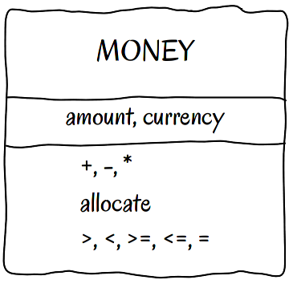

`Money`__
==============

Purpose
-------
Represents money as value object (immutable, compared by value and protects currency invariant in most basic form)

Examples
--------

Please take a look at provided test (Money/Tests/MoneyTest.php) to see how this pattern can be used.

UML Diagram
-----------

Code
----

You can also find this code on `GitHub`_

Money.php

.. literalinclude:: Money.php
   :language: php
   :linenos:

Test
----

Tests/MoneyTest.php

.. literalinclude:: Tests/MoneyTest.php
   :language: php
   :linenos:

.. _`GitHub`: https://github.com/domnikl/DesignPatternsPHP/tree/master/More/Money
.. __: https://martinfowler.com/eaaCatalog/money.html
