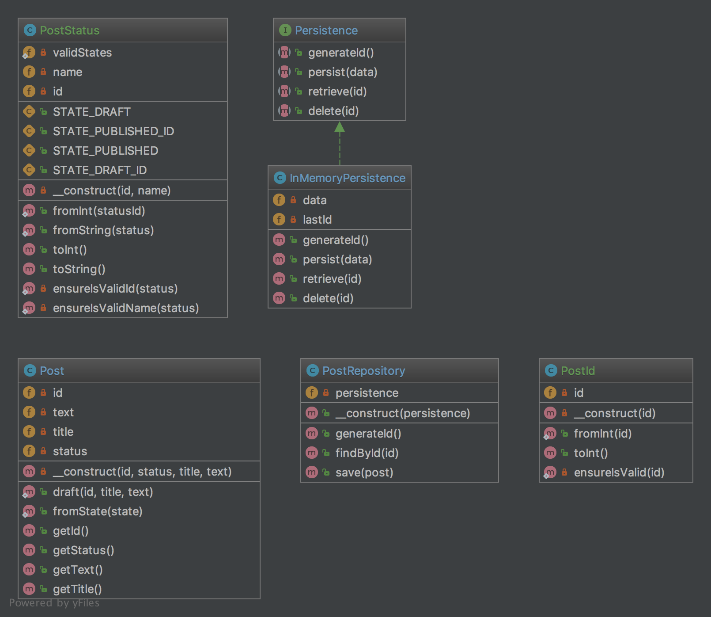

Repository
==========

Purpose
-------

Mediates between the domain and data mapping layers using a
collection-like interface for accessing domain objects. Repository
encapsulates the set of objects persisted in a data store and the
operations performed over them, providing a more object-oriented view of
the persistence layer. Repository also supports the objective of
achieving a clean separation and one-way dependency between the domain
and data mapping layers.

Examples
--------

-  Doctrine 2 ORM: there is Repository that mediates between Entity and
   DBAL and contains methods to retrieve objects
-  Laravel Framework

UML Diagram
-----------

Code
----

You can also find this code on `GitHub`_

Post.php

.. literalinclude:: Domain/Post.php
   :language: php
   :linenos:

PostId.php

.. literalinclude:: Domain/PostId.php
   :language: php
   :linenos:

PostStatus.php

.. literalinclude:: Domain/PostStatus.php
   :language: php
   :linenos:

PostRepository.php

.. literalinclude:: PostRepository.php
   :language: php
   :linenos:

Persistence.php

.. literalinclude:: Persistence.php
   :language: php
   :linenos:

InMemoryPersistence.php

.. literalinclude:: InMemoryPersistence.php
   :language: php
   :linenos:

Test
----

Tests/PostRepositoryTest.php

.. literalinclude:: Tests/PostRepositoryTest.php
    :language: php
    :linenos:

.. _`GitHub`: https://github.com/domnikl/DesignPatternsPHP/tree/master/More/Repository
