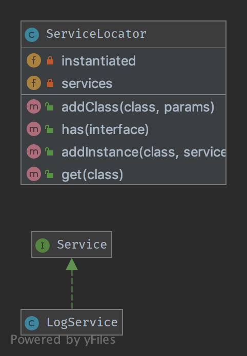

`Service Locator`__
===================

Purpose
-------

To implement a loosely coupled architecture in order to get better
testable, maintainable and extendable code. DI pattern and Service
Locator pattern are an implementation of the Inverse of Control pattern.

Usage
-----

With ``ServiceLocator`` you can register a service for a given
interface. By using the interface you can retrieve the service and use
it in the classes of the application without knowing its implementation.
You can configure and inject the Service Locator object on bootstrap.

Examples
--------

-  Zend Framework 2 uses Service Locator to create and share services
   used in the framework(i.e. EventManager, ModuleManager, all custom
   user services provided by modules, etc...)

UML Diagram
-----------

Code
----

You can also find these code on `GitHub`_

ServiceLocatorInterface.php

.. literalinclude:: ServiceLocatorInterface.php
   :language: php
   :linenos:

ServiceLocator.php

.. literalinclude:: ServiceLocator.php
   :language: php
   :linenos:

LogServiceInterface.php

.. literalinclude:: LogServiceInterface.php
   :language: php
   :linenos:

LogService.php

.. literalinclude:: LogService.php
   :language: php
   :linenos:

DatabaseServiceInterface.php

.. literalinclude:: DatabaseServiceInterface.php
   :language: php
   :linenos:

DatabaseService.php

.. literalinclude:: DatabaseService.php
   :language: php
   :linenos:

Test
----

Tests/ServiceLocatorTest.php

.. literalinclude:: Tests/ServiceLocatorTest.php
   :language: php
   :linenos:

.. _`GitHub`: https://github.com/domnikl/DesignPatternsPHP/tree/master/More/ServiceLocator
.. __: http://en.wikipedia.org/wiki/Service_locator_pattern
