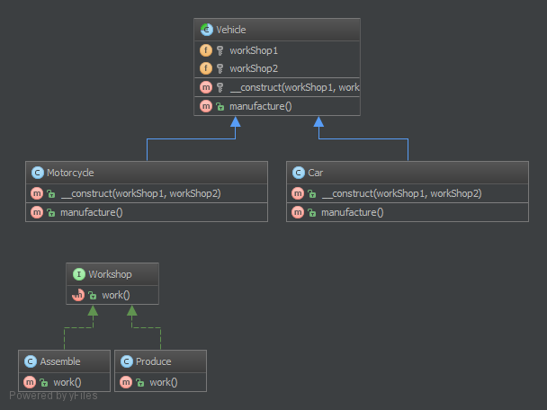

`Bridge`__
==========

Purpose
-------

Decouple an abstraction from its implementation so that the two can vary
independently.

Examples
--------

-  `Symfony
   DoctrineBridge <https://github.com/symfony/DoctrineBridge>`__

UML Diagram
-----------

Code
----

You can also find this code on `GitHub`_

Formatter.php

.. literalinclude:: Formatter.php
   :language: php
   :linenos:

PlainTextFormatter.php

.. literalinclude:: PlainTextFormatter.php
   :language: php
   :linenos:

HtmlFormatter.php

.. literalinclude:: HtmlFormatter.php
   :language: php
   :linenos:

Service.php

.. literalinclude:: Service.php
   :language: php
   :linenos:

HelloWorldService.php

.. literalinclude:: HelloWorldService.php
   :language: php
   :linenos:

PingService.php

.. literalinclude:: PingService.php
   :language: php
   :linenos:

Test
----

Tests/BridgeTest.php

.. literalinclude:: Tests/BridgeTest.php
   :language: php
   :linenos:

.. _`GitHub`: https://github.com/domnikl/DesignPatternsPHP/tree/master/Structural/Bridge
.. __: http://en.wikipedia.org/wiki/Bridge_pattern
