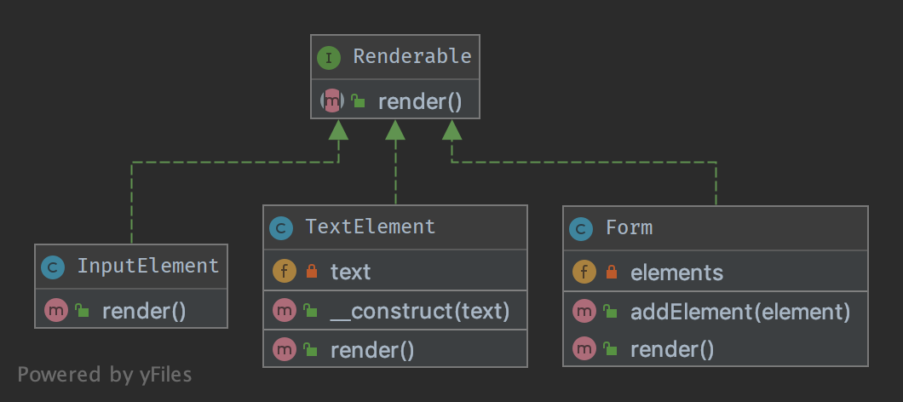

`Composite`__
=============

Purpose
-------

To treat a group of objects the same way as a single instance of the
object.

Examples
--------

-  a form class instance handles all its form elements like a single
   instance of the form, when ``render()`` is called, it subsequently
   runs through all its child elements and calls ``render()`` on them
-  ``Zend_Config``: a tree of configuration options, each one is a
   ``Zend_Config`` object itself

UML Diagram
-----------

Code
----

You can also find these code on `GitHub`_

FormElement.php

.. literalinclude:: FormElement.php
   :language: php
   :linenos:

Form.php

.. literalinclude:: Form.php
   :language: php
   :linenos:

InputElement.php

.. literalinclude:: InputElement.php
   :language: php
   :linenos:

TextElement.php

.. literalinclude:: TextElement.php
   :language: php
   :linenos:

Test
----

Tests/CompositeTest.php

.. literalinclude:: Tests/CompositeTest.php
   :language: php
   :linenos:

.. _`GitHub`: https://github.com/domnikl/DesignPatternsPHP/tree/master/Structural/Composite
.. __: http://en.wikipedia.org/wiki/Composite_pattern
