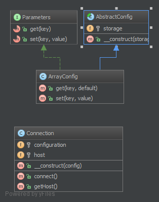

`Dependency Injection`__
========================

Purpose
-------

To implement a loosely coupled architecture in order to get better
testable, maintainable and extendable code.

Usage
-----

``DatabaseConfiguration`` gets injected and ``DatabaseConnection`` will get all that it
needs from ``$config``. Without DI, the configuration would be created
directly in ``DatabaseConnection``, which is not very good for testing and
extending it.

Examples
--------

-  The Doctrine2 ORM uses dependency injection e.g. for configuration
   that is injected into a ``Connection`` object. For testing purposes,
   one can easily create a mock object of the configuration and inject
   that into the ``Connection`` object
-  Symfony and Zend Framework 2 already have containers for DI that
   create objects via a configuration array and inject them where needed
   (i.e. in Controllers)

UML Diagram
-----------

Code
----

You can also find this code on `GitHub`_

DatabaseConfiguration.php

.. literalinclude:: DatabaseConfiguration.php
   :language: php
   :linenos:

DatabaseConnection.php

.. literalinclude:: DatabaseConnection.php
   :language: php
   :linenos:

Test
----

Tests/DependencyInjectionTest.php

.. literalinclude:: Tests/DependencyInjectionTest.php
   :language: php
   :linenos:

.. _`GitHub`: https://github.com/domnikl/DesignPatternsPHP/tree/master/Structural/DependencyInjection
.. __: http://en.wikipedia.org/wiki/Dependency_injection
