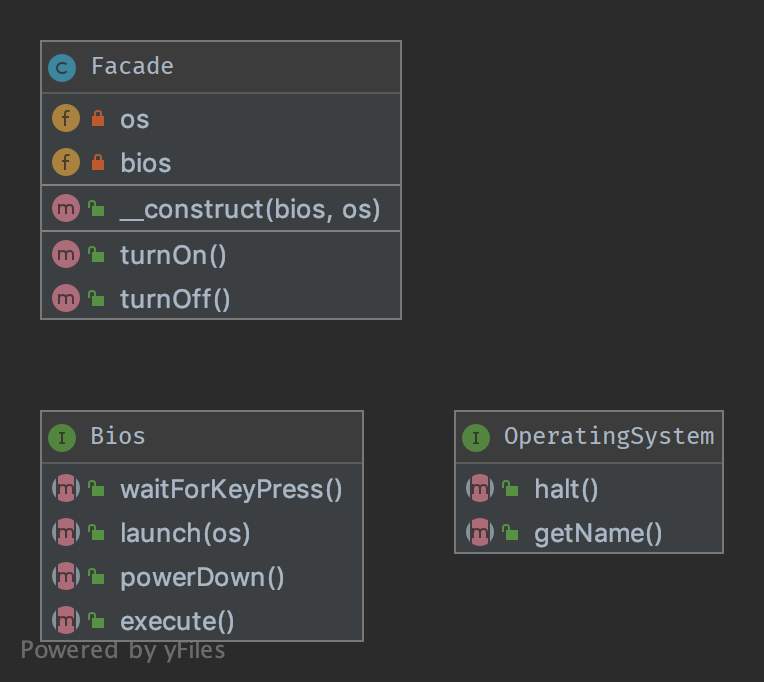

# Facade

## Purpose

The primary goal of a Facade Pattern is not to avoid you to read the manual of a complex API. It's only a side-effect.
The first goal is to reduce coupling and follow the Law of Demeter.

A Facade is meant to decouple a client and a sub-system by embedding many (but sometimes just one) interface, and of course to reduce complexity.

* A facade does not forbid you the access to the sub-system
* You can (you should) have multiple facades for one sub-system

That's why a good facade has no `new` in it. If there are multiple creations for each method, it is not a Facade, it's a Builder or a
[Abstract|Static|Simple] Factory [Method].

The best facade has no `new` and a constructor with interface-type-hinted parameters.
If you need creation of new instances, use a Factory as argument.

## UML Diagram

