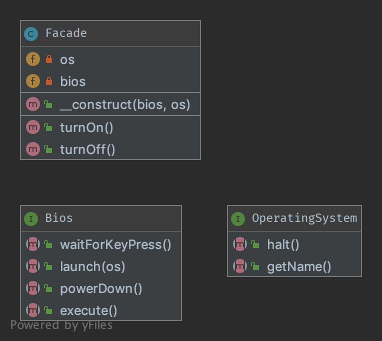

`Facade`__
==========

Purpose
-------

The primary goal of a Facade Pattern is not to avoid you having to read the
manual of a complex API. It's only a side-effect. The first goal is to
reduce coupling and follow the Law of Demeter.

A Facade is meant to decouple a client and a sub-system by embedding
many (but sometimes just one) interface, and of course to reduce
complexity.

-  A facade does not forbid you the access to the sub-system
-  You can (you should) have multiple facades for one sub-system

That's why a good facade has no ``new`` in it. If there are multiple
creations for each method, it is not a Facade, it's a Builder or a
[Abstract\|Static\|Simple] Factory [Method].

The best facade has no ``new`` and a constructor with
interface-type-hinted parameters. If you need creation of new instances,
use a Factory as argument.

UML Diagram
-----------

Code
----

You can also find this code on `GitHub`_

Facade.php

.. literalinclude:: Facade.php
   :language: php
   :linenos:

OperatingSystem.php

.. literalinclude:: OperatingSystem.php
   :language: php
   :linenos:

Bios.php

.. literalinclude:: Bios.php
   :language: php
   :linenos:

Test
----

Tests/FacadeTest.php

.. literalinclude:: Tests/FacadeTest.php
   :language: php
   :linenos:

.. _`GitHub`: https://github.com/DesignPatternsPHP/DesignPatternsPHP/tree/main/Structural/Facade
.. __: http://en.wikipedia.org/wiki/Facade_pattern
