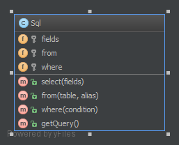

`Fluent Interface`__
====================

Purpose
-------

To write code that is easy readable just like sentences in a natural
language (like English).

Examples
--------

-  Doctrine2's QueryBuilder works something like that example class
   below
-  PHPUnit uses fluent interfaces to build mock objects
-  Yii Framework: CDbCommand and CActiveRecord use this pattern, too

UML Diagram
-----------

Code
----

You can also find this code on `GitHub`_

Sql.php

.. literalinclude:: Sql.php
   :language: php
   :linenos:

Test
----

Tests/FluentInterfaceTest.php

.. literalinclude:: Tests/FluentInterfaceTest.php
   :language: php
   :linenos:

.. _`GitHub`: https://github.com/domnikl/DesignPatternsPHP/tree/master/Structural/FluentInterface
.. __: http://en.wikipedia.org/wiki/Fluent_interface