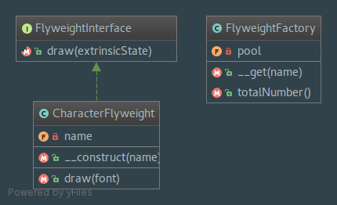

`Flyweight`__
==========

Purpose
-------

To minimise memory usage, a Flyweight shares as much as possible memory with similar objects. It
is needed when a large amount of objects is used that don't differ much in state. A common practice is
to hold state in external data structures and pass them to the flyweight object when needed.

UML Diagram
-----------

Code
----

You can also find these code on `GitHub`_

FlyweightInterface.php

.. literalinclude:: FlyweightInterface.php
   :language: php
   :linenos:

CharacterFlyweight.php

.. literalinclude:: CharacterFlyweight.php
   :language: php
   :linenos:

FlyweightFactory.php

.. literalinclude:: FlyweightFactory.php
   :language: php
   :linenos:

Test
----

Tests/FlyweightTest.php

.. literalinclude:: Tests/FlyweightTest.php
   :language: php
   :linenos:

.. _`GitHub`: https://github.com/domnikl/DesignPatternsPHP/tree/master/Structural/Flyweight
.. __: https://en.wikipedia.org/wiki/Flyweight_pattern
