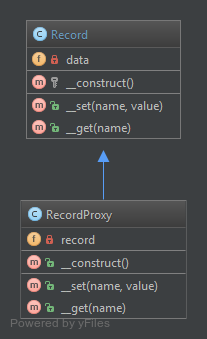

`Proxy`__
=========

Purpose
-------

To interface to anything that is expensive or impossible to duplicate.

Examples
--------

-  Doctrine2 uses proxies to implement framework magic (e.g. lazy
   initialization) in them, while the user still works with his own
   entity classes and will never use nor touch the proxies

UML Diagram
-----------

Code
----

You can also find these code on `GitHub`_

Record.php

.. literalinclude:: Record.php
   :language: php
   :linenos:

RecordProxy.php

.. literalinclude:: RecordProxy.php
   :language: php
   :linenos:

Test
----

.. _`GitHub`: https://github.com/domnikl/DesignPatternsPHP/tree/master/Structural/Proxy
.. __: http://en.wikipedia.org/wiki/Proxy_pattern
