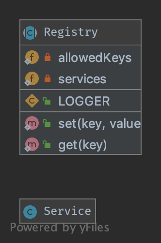

`Registry`__
============

Purpose
-------

To implement a central storage for objects often used throughout the
application, is typically implemented using an abstract class with only
static methods (or using the Singleton pattern). Remember that this introduces
global state, which should be avoided at all times! Instead implement it using Dependency Injection!

UML Diagram
-----------

Code
----

You can also find this code on `GitHub`_

Registry.php

.. literalinclude:: Registry.php
   :language: php
   :linenos:

Service.php

.. literalinclude:: Service.php
   :language: php
   :linenos:

Test
----

Tests/RegistryTest.php

.. literalinclude:: Tests/RegistryTest.php
   :language: php
   :linenos:

.. _`GitHub`: https://github.com/DesignPatternsPHP/DesignPatternsPHP/tree/main/Structural/Registry
.. __: http://en.wikipedia.org/wiki/Service_locator_pattern
